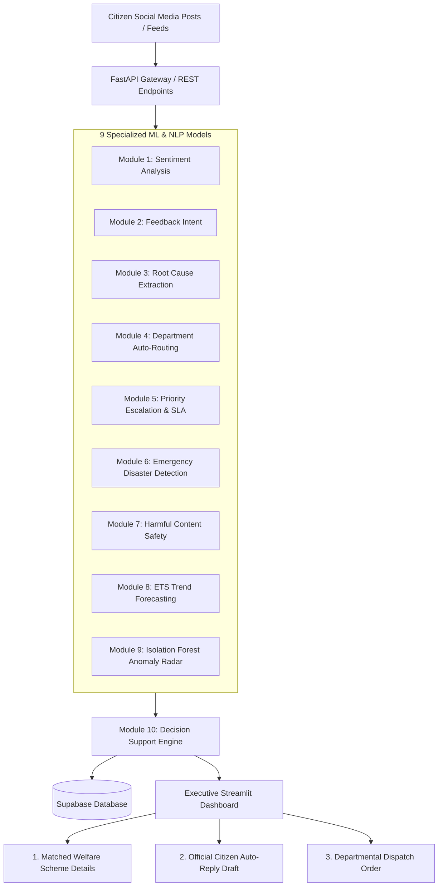

# 🏛️ Government Social Media Analytics & Decision Support System (GovDSS)

[](https://www.python.org/)
[](https://fastapi.tiangolo.com/)
[](https://streamlit.io/)
[](https://scikit-learn.org/)
[](https://supabase.com/)

An enterprise-grade AI decision support platform that automatically ingests citizen feedback from social media platforms (Twitter/X, Facebook, YouTube, Reddit, Instagram), executes **9 Machine Learning models**, and generates automated governance actions—including **3,400+ Government Scheme recommendations**, **citizen reply drafts**, and **departmental dispatch work orders**.

---

## 🌟 Key Features & Capabilities

- **9 Specialized Machine Learning Modules**:
  1. **Sentiment Analysis**: Quantifies citizen satisfaction (Positive / Negative / Neutral).
  2. **Feedback Categorization**: Classifies intent (Complaint, Suggestion, Praise, Inquiry).
  3. **Complaint Root Cause Extraction**: Pinpoints the exact infrastructure/service issue.
  4. **Department Auto-Routing**: Routes tickets to Roads, Water, Electricity, Health, Sanitation, or Education.
  5. **Priority Escalation & SLA**: Predicts urgency (High / Medium / Low) with 24h/72h SLA targets.
  6. **Emergency & Disaster Detection**: Flags life-safety hazards (accidents, floods, fires, collapses).
  7. **Harmful Content & Safety Watch**: Intercepts toxic speech and threats using HASOC safety models.
  8. **Predictive Trend Forecasting (ETS)**: Time-series forecasting (3–24 months) for seasonal surge planning.
  9. **Anomaly & Surge Radar (Isolation Forest)**: Unsupervised detection of viral complaints and infrastructure crises.
- **Module 10: Governance Action Engine**:
  - Automatically matches applicable welfare schemes from a knowledge base of **3,400+ Central and State schemes**.
  - Drafts empathetic, official social media replies with unique tracking reference IDs.
  - Generates standardized departmental dispatch tickets for field engineers.
- **Executive Command Dashboard (Streamlit)**:
  - 7 interactive modules with Plotly visualizations, live filter bars, and 1-click test presets.

---

## 🏛️ System Architecture



---

## 📂 Project Structure

```
ML-Project/
├── App/
│   ├── backend/
│   │   ├── database/          # Supabase connector & schemas
│   │   ├── config.py          # Environment settings
│   │   ├── main.py            # FastAPI REST application
│   │   └── predict.py         # 9-module ML orchestrator
│   ├── frontend/
│   │   ├── .streamlit/        # Streamlit configuration
│   │   └── app.py             # Executive GovTech Command Dashboard
│   └── Pickles/               # 20+ Trained ML models & vectorizers
├── Data/                      # Datasets for civic grievances & schemes
├── Notebooks/                 # 9 Model training & EDA Jupyter notebooks
├── government_schemes_final.csv # 3,400+ Government schemes catalog
├── requirements.txt           # Unified dependency specifications
└── README.md                  # Project documentation
```

---

## 🚀 Quickstart Guide

### 1. Prerequisites & Installation
Clone the repository and install all dependencies:
```bash
git clone https://github.com/YOUR_USERNAME/YOUR_REPO_NAME.git
cd ML-Project
pip install -r requirements.txt
```

### 2. Launch the Streamlit Frontend
```bash
streamlit run App/frontend/app.py
```
*Access the dashboard at: `http://localhost:8501`*

### 3. (Optional) Launch the FastAPI Backend
```bash
cd App/backend
uvicorn main:app --reload
```
*API docs available at: `http://127.0.0.1:8000/docs`*

---

## 🛠️ Technology Stack

- **Machine Learning**: Scikit-Learn, Statsmodels (ETS), Isolation Forest, TF-IDF, Joblib.
- **Backend**: FastAPI, Pydantic, Uvicorn, REST Architecture.
- **Frontend**: Streamlit, Plotly Express & Graph Objects, Custom GovTech CSS.
- **Database**: Supabase (PostgreSQL).
- **Languages**: Python 3.10+.
